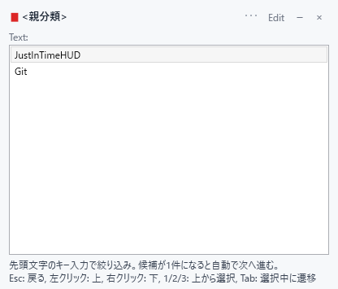
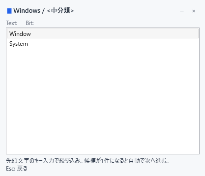
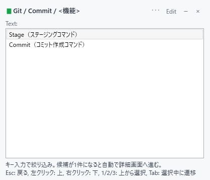
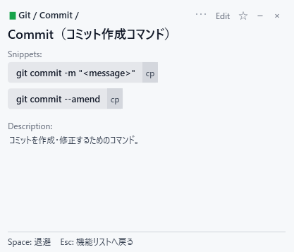

# Just-in-Time HUD

Just-in-Time HUD は、ショートカット、コマンド、操作手順、テンプレートを必要な瞬間に素早く参照するための Windows 向け HUD です。

新しい効率化機能を追加するのではなく、OS・アプリ・エディタ・CLI が既に持っている機能へ到達する時間を短くすることを目的にしています。

## スクリーンショット

|  |  |  |  |
| :---: | :---: | :---: | :---: |
| 親分類 | 中分類 | 機能リスト | 詳細画面 |

## 特徴

- PowerShell / .NET WPF で動作
- インストール不要
- 管理者権限不要
- グローバルキーフックなし
- HUD退避後に直前の作業ウィンドウへフォーカス復帰
- ショートカット、コピー可能コマンド、長文手順、説明のみ項目に対応
- 直近で開いた詳細を次回表示時に別パネルで再表示
- タスクバー用アイコンを同梱
- 開発時は `src/` の分割ファイル、配布時は単一 `dist/JustInTimeHud.ps1`

## 起動

開発用起動:

```powershell
.\run-dev.ps1
```

単一ファイルを生成:

```powershell
.\build.ps1
```

生成された単一ファイルを実行:

```powershell
.\dist\JustInTimeHud.ps1
```

`dist\JustInTimeHud.ps1` は初期データと初期設定を内蔵しています。同じフォルダに `hud-items.json` や `settings.jsonc` が無い場合は、初回起動時に自動生成します。

コンソールを表示せずに起動:

```text
dist\JustInTimeHud.vbs
```

`JustInTimeHud.vbs` は同じフォルダにある `JustInTimeHud.ps1` を `pwsh.exe` で起動します。配布するときは `dist\JustInTimeHud.ps1` と `dist\JustInTimeHud.vbs` を同じフォルダに置いてください。

配布時の最小構成:

```text
JustInTimeHud.ps1
JustInTimeHud.vbs
```

初回起動後:

```text
JustInTimeHud.ps1
JustInTimeHud.vbs
hud-items.json
settings.jsonc
```

検証:

```powershell
.\verify.ps1
```

`verify.ps1` は `src/` と生成後の `dist/JustInTimeHud.ps1` の構文確認を行います。

## 基本操作

HUDはタスクバーに表示されます。タスクバーにピン留めすると、`Win + 数字` で呼び出しやすくなります。

### 共通操作:

| 操作 | 動作 |
| --- | --- |
| Space | HUDを退避 |
| Esc | 入力リセット、前の画面へ戻る、Rootなら退避 |
| Edit | HUD項目JSONを追加・削除・編集 |
| × | アプリ終了 |
| ー | HUD退避 |
| タイトル部ドラッグ | HUDパネルを移動 |

### 親分類・中分類:

| 操作 | 動作 |
| --- | --- |
| 先頭文字キー | 候補を絞り込み |
| 候補が1件 | 自動で次へ進む |
| 左クリック | リストを上へ移動 |
| 右クリック | リストを下へ移動 |
| Tab | 選択中に遷移 |
| 1 / 2 / 3 | 上から1-3件目を直接選択 |

### 機能リスト:

| 操作 | 動作 |
| --- | --- |
| 先頭文字キー | 機能名で絞り込み |
| 候補が1件 | 詳細画面へ進む |
| 左クリック | リストを上へ移動 |
| 右クリック | リストを下へ移動 |
| 1 / 2 / 3 | 上から1-3件目を直接選択 |
| Tab | 選択中に遷移 |

### 詳細画面:

| 操作 | 動作 |
| --- | --- |
| Space | HUD退避 |
| Esc | 機能リストへ戻る |
| ☆ / ★ | お気に入り切替 |
| Copy | `copyable: true` の snippet をコピー |
| Ctrl + C | 選択した snippet / description をコピー |

## 画面

HUDは1つの全画面WPFウィンドウ内に、複数のパネルを配置しています。

- 検索HUDパネル
- 直近詳細HUDパネル
- お気に入りHUDパネル

直近詳細HUDは、最後に開いた詳細情報を保存し、次にHUDを表示したときに別位置へ表示します。同じコマンドや手順を何度も検索し直さずに参照できます。

お気に入りHUDは、`favorite: true` の機能を個別パネルとして表示します。詳細画面の `☆ / ★`、または Edit 画面の `favorite` で切り替えできます。

## データ

HUD項目は `hud-items.json` に記述します。

基本形:

```json
[
  {
    "name": "Terminal",
    "groups": [
      {
        "name": "Git",
        "features": [
          {
            "title": "Status（変更状況を確認）",
            "snippets": [
              "git status --short",
              "git diff --stat"
            ],
            "copyable": true,
            "description": "作業ツリーの変更状況を短い形式で確認する。"
          }
        ]
      }
    ]
  }
]
```

フィールド:

| フィールド | 必須 | 説明 |
| --- | --- | --- |
| `name` | 必須 | 親分類または中分類の名前 |
| `features` | 必須 | 中分類に属する機能一覧 |
| `title` | 必須 | 機能名。先頭文字入力の対象 |
| `snippets` | 任意 | コピー候補の文字列配列。ショートカット、コマンド、テンプレートなど |
| `copyable` | 任意 | `true` のとき各 snippet に Copy ボタンを表示 |
| `favorite` | 任意 | `true` のときお気に入りHUDパネルに表示 |
| `description` | 必須 | 説明文。複数行も可 |

`snippets` がない項目は、詳細画面で Snippets 欄を表示せず、Description のみ表示します。旧形式の `shortcut` と、旧 `snippets[].text` 形式は読み込み互換として扱います。

`hud-items.json` が無い場合は、単一ファイルに埋め込まれた初期データから自動生成されます。開発時の初期データは `data/hud-items.sample.json` を編集し、`build.ps1` で単一ファイルへ埋め込みます。

HUD右上の `Edit` から、親分類・中分類・機能の追加、削除、編集、保存ができます。保存先は実行中のデータファイルです。配布版では `hud-items.json`、開発起動では `data/hud-items.sample.json` に保存されます。

## 設定

`settings.jsonc` で表示位置、サイズ、フォント、背景色を変更できます。

```jsonc
{
  "panelX": 1480,
  "panelY": 20,
  "recentPanelX": 1480,
  "recentPanelY": 395,
  "panelWidth": 420,
  "panelHeight": 360,
  "showRecentPanel": true,
  "fontFamily": "Yu Gothic UI",
  "titleFontSize": 13,
  "detailTitleFontSize": 13,
  "featureTitleFontSize": 18,
  "filterFontSize": 12,
  "listFontSize": 12,
  "detailFontSize": 12,
  "snippetMaxHeight": 80,
  "backgroundRgba": {
    "r": 0,
    "g": 0,
    "b": 0,
    "a": 0.1
  }
}
```

主な設定:

| 設定 | 説明 |
| --- | --- |
| `panelX`, `panelY` | 検索HUDパネルの左上座標 |
| `recentPanelX`, `recentPanelY` | 直近詳細HUDパネルの左上座標 |
| `panelWidth`, `panelHeight` | メイン、直近、お気に入りの各HUDパネル共通サイズ |
| `showRecentPanel` | 直近詳細HUDを表示するか |
| `fontFamily` | HUD全体のフォント |
| `featureTitleFontSize` | 詳細画面の機能名タイトルサイズ |
| `snippetMaxHeight` | Snippets 1件あたりの最大表示高さ |
| `backgroundRgba` | 全画面背景のRGBA |

`backgroundRgba.a` は `0.0` から `1.0`、または `0` から `255` で指定できます。

`settings.jsonc` が無い場合は、単一ファイルに埋め込まれた初期設定から自動生成されます。

## リポジトリ構成

```text
build.manifest.psd1
build.ps1
run-dev.ps1
verify.ps1
settings.jsonc
data/
  hud-items.sample.json
assets/
  icon.svg
  icon.png
  icon.ico
  header/
    just-in-time-hud-header.png
  screenshots/
    root-category.png
    group-category.png
    feature-list.png
    detail-view.png
src/
  App/
  Config/
  Domain/
  Infrastructure/
  UI/
dist/
  JustInTimeHud.ps1
  JustInTimeHud.vbs
tools/
```

開発時は `src/` 以下を編集します。初期データは `data/hud-items.sample.json`、初期設定は `settings.jsonc` を編集します。`dist/JustInTimeHud.ps1` は `build.ps1` で生成される単一ファイルです。
